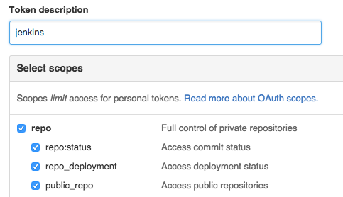
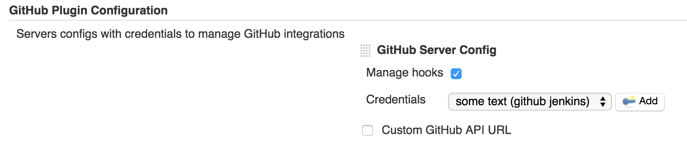
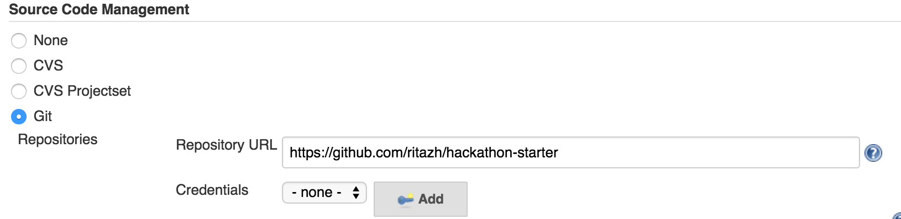
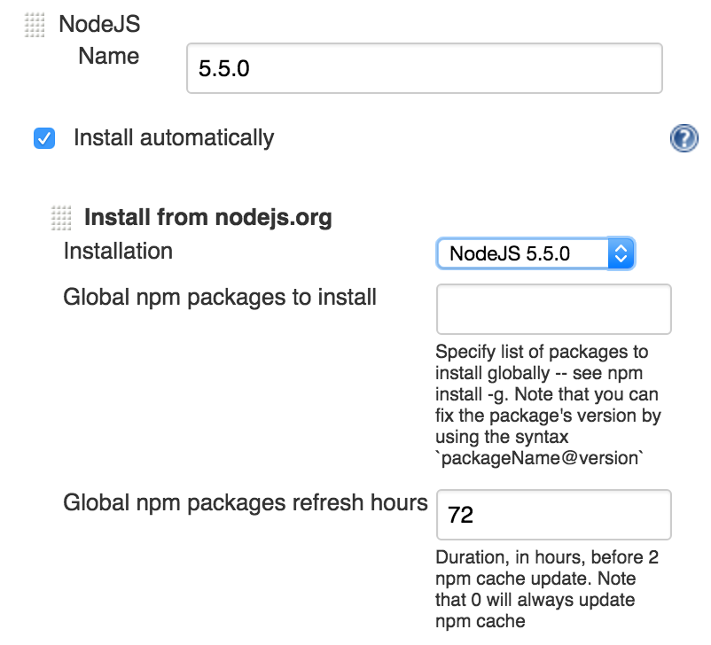
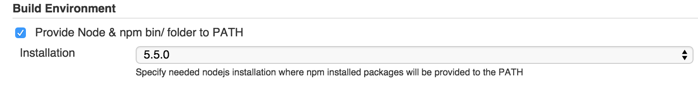
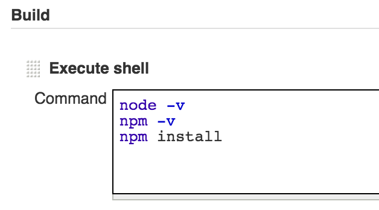
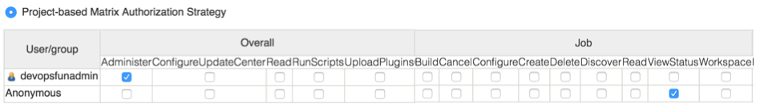
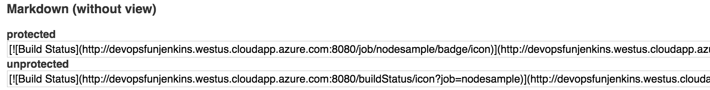
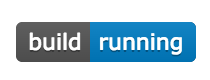

## Continuously Integrate and Deploy an App
In the previous module, we looked at how to provision a Jenkins cluster on Azure to support continuously integrate of applications. Now in this module, let's see how we can use Jenkins to continuously build Node.js projects and continously deploy application updates to our Dokku test environment within minutes. We start the pipeline by integrating with GitHub to automatically trigger this CI pipeline to run when a change is pushed to GitHub. Then we end with pushing updates to Dokku environment.

### Installing Plugins
Jenkins provides hundreds of plugins to support building, testing, deploying, and automation for virtually any project. 

From your browser, click `Manage Jenkins` in the navigation sidebar and then click `Manage Plugins`. From the `Available` tab, search and select the following plugins:
- GitHub Plugin
- Embeddable Build Status Plugin
- NodeJS Plugin

Click `Install without restart` to install the plugins and all the dependencies for these plugins. Once all plugins indicate `Success`, click the checkbox next to "Restart Jenkins" at the bottom to finish the installation.

<figure>
  
  <figcaption>Screenshot of Restarting Jenkins</figcaption>
</figure>

### Integrating with GitHub
To create an end-to-end CI pipeline for an application, we need to start with cloning the code from the code source repository. Jenkins supports many source code management systems. With the GitHub plugin, we can integrate with each one of our GitHub repository through the GitHub API. Let’s add GitHub credentials for cloning repositories.

First, we need to generate a GitHub token to use with the GitHub API to ensure the GitHub account has administrative rights to the repos. From your browser, go to GitHub and ensure you are logged in with the account you want to use. Then, visit the `Settings` page, then select `Personal access tokens` from the sidebar. To the right, click `Generate new token`. In the form, set the relevant permissions to enable the hooks to work properly in Jenkins by giving the hook a name, check `repo` and then clicking `Generate token`. Copy and save the generated key.

<figure>
  
  <figcaption>Screenshot of generating a GitHub toke for Jenkins</figcaption>
</figure>

From your browser, click `Manage Jenkins` then click `Configure System`. Under `GitHub Plugin Configuration`, click `Add GitHub Server Config` to add credentials. Click `Add` next to the `Credentials` dropdown. From `Add Credentials` view, select `Secret text` from the dropdown. Set `Scope` to `Global` and paste the GitHub token in `Secret` text field. Provide a description, for example `github jenkins`. Then click `Add`. Now the `Credentials` dropdown should be set to the Jenkins Credential we just created. Click `Verify credentials` to verify connectivity. Click Save.

<figure>
  
  <figcaption>Screenshot of Jenkins GitHub Plugin</figcaption>
</figure>

##### Installing Git on Jenkins
Since we are using git to clone our repo to Jenkins servers and we are using git to push to our Dokku test environment, we need to install git on Jenkins servers. First ssh into Jenkins master VM:

$ ssh <adminUsername>@<dnsName>.<LOCATION>.cloudapp.azure.com
# Use the same adminUsername, adminPassword as you provided for azuredeploy.parameters.json


Once logged into the Jenkins VMs, run the `sudo apt-get install git` to install git.

### Creating a Jenkins Job
Now let's setup a new Jenkins job for our Node.js project. From your browser, click `New Item`, provide a name for the job, for example `nodesample`, select the `Freestyle project` option. Then hit OK. In the configuration page, check the `GitHub project` box, then for `Project url`, provide the http url to your Node.js app GitHub repo. Under `Source Code Management`, select the `Git` radio button. For `Repository URL`, provide the http url to your Node.js app GitHub repo. 

<figure>
  
  <figcaption>Screenshot of Jenkins Git repo</figcaption>
</figure>

Next, make sure to check the `Build when a change is pushed to GitHub` option as that will automatically trigger this job to run whenever a change has been commited to the master branch of the GitHub repo. Click Save.

Now go ahead and checkin some changes to your repo. You should see this Jenkins job automatically running as soon as you do a `git push`. 

<figure>
  
  <figcaption>Screenshot of Jenkins job triggered by git push</figcaption>
</figure>

### Setting up Node
To build and test Node.js applications with Jenkins, we need to configure the NodeJS plugin to build applications against different versions of Node. It also handles the installations and writes Jenkins scripts in Node. From Jenkins, click `Manage Jenkins` and `Configure System`. Under `NodeJS` section, click `NodeJS installations`. For NodeJS Name, provide a value so you can easily refer to it in a job. Check the `Install automatically` box, click `Add Installer` dropdown to select `Install from nodejs.org`. Select `NodeJS 5.5.0` for `Installation`. Leave npm packages empty, since we will build dependencies locally for each job. Click Save.

> Note: If you are using Jenkins 2, the UI is a little different. You can find `NodeJS` configuration settings under `Manage Jenkins` and `Configure Tools`. 

<figure>
  
  <figcaption>Screenshot of Setting up Node on Jenkins</figcaption>
</figure> 

Now from Jenkins, let's configure our job to use a specific Node installation to build the application.
From your browser, click the job for your Node application, for example `nodesample`. Scroll down to `Build Environment` and check `Provide Node & npm bin/ folder to PATH`. Then, select the desired Node installation to build this application.

<figure>
  
  <figcaption>Screenshot of Set Node version for a Job</figcaption>
</figure> 

To test our installation of Node, let's build our Node app on Jenkins. Scroll down to `Build` section, click `Add build step`. Let's confirm the Node and npm versions and let's execute `npm install` to build the app. Click Save.

<figure>
  
  <figcaption>Screenshot of Build shell for job</figcaption>
</figure> 

Let's build this job by clicking `Build Now`. To see the output of this job, click on the running instance and `Console Output`. The output should contain something like the following:


+ node -v
v5.5.0
+ npm -v
3.6.0
+ npm install
...
Finished: SUCCESS


### Exposing Build Badges
Build badges can be added to your Github readme.md and elsewhere that indicate the state of the build. From your browser, click `Manage Jenkins` then click `Configure Global Security`. Under `Authorization` and `Project-based Matrix Authorization Strategy`, in the matrix table, for the `Anonymous` user, check  `ViewStatus` under the `Job` category. Then Save.

<figure>
  
  <figcaption>Screenshot of Configuring Jenkins anonymous view access</figcaption>
</figure>

To get the build badge for our application, from Jenkins, click into the job for our application. Click the `Embeddable Build Status` icon in the project sidebar to reveal embeddable markup. Copy and paste the relevant format for your readme file. Make sure to copy the unprotected markup so it can be accessed anonymously.

<figure>
  
  <figcaption>Screenshot of Get Jenkins Job Build Status</figcaption>
</figure>

Now add the badge status markup to the top  the `README.md` file in your node.js sample app. Commit your changes and `git push origin master`. This will kickoff the job we just created in Jenkins and the real-time status of the current build will be visible on the main page of your GitHub repo.

<figure>
  
  <figcaption>Screenshot of Build Badge on GitHub</figcaption>
</figure> 

### Configuring Jenkins to Deploy to Dokku
Recall from the previous [deploying app](../deploying-app/#add-ssh-key) module, before we could `git push` our app to Dokku, we had to create and add an SSH key for deploying apps to Dokku. Now we need to do the same for the Jenkins user.

#### Creating SSH Key for the Jenkins User
Before you can push anything to remote git on Dokku, we have to first create a pair of SSH key to be used for pushing apps to Dokku. SSH into the Jenkins server with the jenkinsadmin credentials. Then `su jenkins` to run the following commands as the jenkins user. Note, run the following without passphrase to avoid password prompt later. The resulting key pair will be generated in your current directory.


$ ssh-keygen -t rsa
Generating public/private rsa key pair.
Enter file in which to save the key (/var/lib/jenkins/.ssh/id_rsa): jenkinsdokku
Enter passphrase (empty for no passphrase): 
Enter same passphrase again: 
Your identification has been saved in jenkinsdokku.
Your public key has been saved in jenkinsdokku.pub.


#### Adding a Deploy User for Jenkins to Dokku
Now let's use the key you just created to add a new deploy user to Dokku. To add the new key, we need the old key to ssh into the dokku VM. Copy the `dokku` key we generated from the [provision platform](../provisioning-platform/#provisioning-resources-for-dokku-on-azure) module to the jenkins user root directory. Then run the following:


# To give the jenkins user read permission, and removes all other permission
$ chmod 400 ~/dokku

# Add the jenkinsdokku public key to dokku to allow git push access
$ cat ~/.ssh/jenkinsdokku.pub | ssh -i ~/.ssh/dokku <your-admin-user-name>@<DNSNAMEFORPUBLICIP>.<LOCATION>.cloudapp.azure.com "sudo sshcommand acl-add dokku jenkinsdokku"
4d:94:8d:d4:2e:6a:3b:22:e7:a6:66:ea:8e:ad:b0:e5


### Configuring Job to Push Updates to Dokku
From Jenkins in the browser, click the job you have created previously for the node.js app. Click `Add build step` to add the following commands to the `Execute Shell` section after `npm install`.


git checkout master
git fetch origin master
git reset --hard origin/master
git pull origin master

eval `ssh-agent -s`
ssh-add /var/lib/jenkins/jenkinsdokku

if git remote | grep dokku > /dev/null;
then
echo "dokku already exist";
else
echo "dokku remote does not already exist";
git remote add dokku dokku@<DNSNAMEFORPUBLICIP>.<LOCATION>.cloudapp.azure.com:hackathon-starter;
fi
git remote -v

git push -f dokku master


#### What is this script doing? 
First we use `git` to checkout the latest code from remote master. Then we check if dokku remote already exists, if not, we add dokku remote with `git remote add dokku dokku@<DNSNAMEFORPUBLICIP>.<LOCATION>.cloudapp.azure.com:hackathon-starter`. Note, once dokku remote has been added, you do not need to re-add it. Before the job can `git push -f dokku master`, we need to add the ssh key to the running ssh-agent for the Jenkins user with `ssh-add`. Finally we push the latest to dokku master.

Now go ahead and commit some changes to your node.js app repo. This will kickoff the Jenkins job we just updated. To see the output of this job, click on the running instance and `Console Output`. The output should contain something like the following:


<Omitted>
...

+ git checkout master
Previous HEAD position was 4f83421... push changes to test CI
Switched to branch 'master'
Your branch and 'origin/master' have diverged,
and have 1 and 1 different commit each, respectively.
  (use "git pull" to merge the remote branch into yours)
+ git fetch origin master
From https://github.com/<your_github_username>/hackathon-starter
 * branch            master     -> FETCH_HEAD
+ git reset --hard origin/master
HEAD is now at 4f83421 push changes to test CI
+ git pull origin master
From https://github.com/<your_github_username>/hackathon-starter
 * branch            master     -> FETCH_HEAD
Already up-to-date.
+ ssh-agent -s
+ eval SSH_AUTH_SOCK=/tmp/ssh-WRh1bG5Amjtc/agent.22893; export SSH_AUTH_SOCK; SSH_AGENT_PID=22894; export SSH_AGENT_PID; echo Agent pid 22894;
+ SSH_AUTH_SOCK=/tmp/ssh-WRh1bG5Amjtc/agent.22893
+ export SSH_AUTH_SOCK
+ SSH_AGENT_PID=22894
+ export SSH_AGENT_PID
+ echo Agent pid 22894
Agent pid 22894
+ ssh-add /var/lib/jenkins/jenkinsdokku
Identity added: /var/lib/jenkins/jenkinsdokku (/var/lib/jenkins/jenkinsdokku)
+ git remote
+ grep dokku
+ echo dokku remote does not already exist
dokku remote does not already exist
+ git remote add dokku dokku@<DNSNAMEFORPUBLICIP>.<LOCATION>.cloudapp.azure.com:hackathon-starter
+ git remote -v
dokku	dokku@<DNSNAMEFORPUBLICIP>.<LOCATION>.cloudapp.azure.com:hackathon-starter (fetch)
dokku	dokku@<DNSNAMEFORPUBLICIP>.<LOCATION>.cloudapp.azure.com:hackathon-starter (push)
origin	https://github.com/<your_github_username>/hackathon-starter.git (fetch)
origin	https://github.com/<your_github_username>/hackathon-starter.git (push)
+ git push -f dokku master
remote: -----> Cleaning up...
remote: -----> Building hackathon-starter from herokuish...
remote: -----> Adding BUILD_ENV to build environment...
remote: setuidgid: fatal: unable to run /tmp/buildpacks/heroku-buildpack-multi/bin/detect: text busy
remote:        -----> Node.js app detected
...
<Omitted>
...
remote:        Express server listening on port 5000 in development mode
remote: =====> end hackathon-starter container output
remote: -----> Running post-deploy
remote: -----> Configuring hackathon-starter.<HOSTPUBLICIP>.xip.io...
remote: -----> Creating http nginx.conf
remote: -----> Running nginx-pre-reload
remote:        Reloading nginx
remote: -----> Setting config vars
remote:        DOKKU_APP_RESTORE: 1
remote: -----> Shutting down old containers in 60 seconds
...
remote: =====> Application deployed:
remote:        http://hackathon-starter.<HOSTPUBLICIP>.xip.io
remote: 
To dokku@<DNSNAMEFORPUBLICIP>.<LOCATION>.cloudapp.azure.com:hackathon-starter
 + 544dace...4f83421 master -> master (forced update)
[ssh-agent] Stopped.
Finished: SUCCESS


