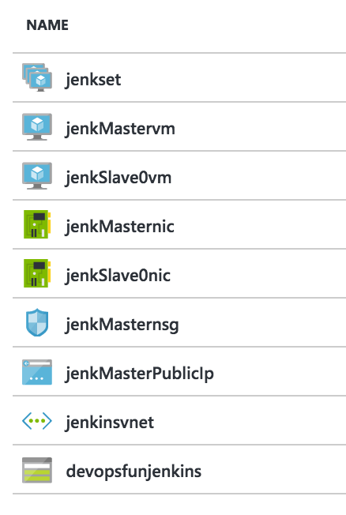
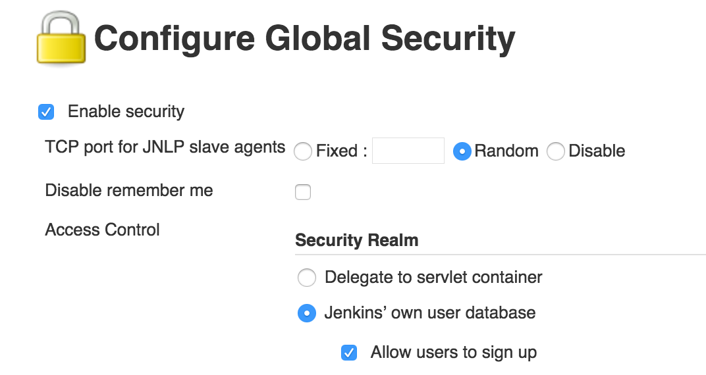
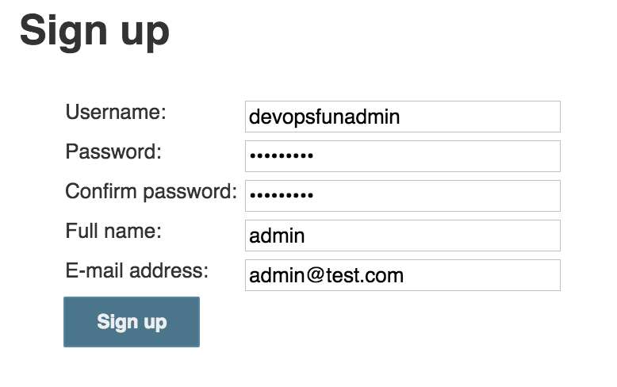
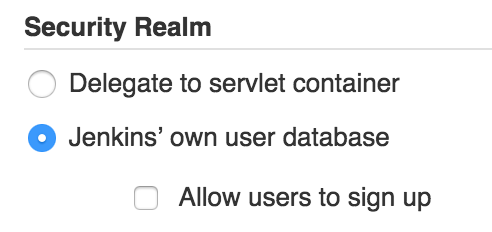

## Adding Continuous Integration
In the previous module, you learned how to manually push an application to a test environment from our local dev machine. Now what about running tests, and deploy to staging and production? There are many continuous integration solutions in the market. In this module, we will look one of the CI solutions and to see how to setup and configure a Jenkins instance so that we can create an end-to-end continuous integration pipeline for our Node.js application in the next module. If you already have a running Jenkins instance, you can skip this module and go straight to the next one to setup your own pipeline.

### What is Jenkins
[Jenkins](https://jenkins-ci.org/) is an open source automation tool written in Java. It provides continous integration services for application development. With a huge open source community, it provides hundreds of plugins to support building, testing, deploying, and automation for virtually any project. 

It enables developers to automate end-to-end build, test, and deployment process from pushing code updates to a source repository to deploying the latest features to a production environment in minutes.

### Provisioning Resources for Jenkins on Azure 
To setup a Jenkins instance on Microsoft Azure, we need to provision all the required resources for Jenkins. At the end of this step, we should have two virtual machines (one Jenkins master node on an Ubuntu virtual machine and a Jenkins slave node on another VM), a storage account, virtual network, availability sets, public IP addresses and network interfaces required by the installation.

Now, let's login to Azure CLI. If you have not installed the Azure CLI, please install the [Azure CLI](https://azure.microsoft.com/en-us/documentation/articles/xplat-cli-install/) to provision resources using an Azure Resource Manager (ARM) template.

First login to the Azure CLI:

$ azure login


Instruct the client to switch to ARM mode:

$ azure config mode arm


Next, download [azuredeploy.json](https://github.com/Azure/azure-quickstart-templates/blob/master/jenkins-on-ubuntu/azuredeploy.json) and [azuredeploy.parameters.json](https://github.com/Azure/azure-quickstart-templates/blob/master/jenkins-on-ubuntu/azuredeploy.parameters.json) locally. Edit `azuredeploy.parameters.json` to provide values to the parameters required for the cluster. You can also refer to a sample `azuredeploy.parameters.json` [here](https://github.com/ritazh/devopsfun/blob/gh-pages/provisionjenkins/azuredeploy.parameters.json)for your reference.

- For `storageAccountPrefix`, `virtualNetworkName`, and `dnsName`, you need to provide unique values for these fields.

To kickoff deployment on Azure, type the following in terminal:

$ azure group create --name devopsfunrgjenkins --location "West US" --deployment-name devopsfun --template-file azuredeploy.json --parameters-file azuredeploy.parameters.json


Actual deployment time may vary. It should take less than 5 minutes for provision to complete.

To verify, you can check the `ProvisionState` by running the following command in terminal. When the deployment is completed, the `ProvisionState` should go from `Running` to `Succeeded`. 

$ azure group deployment show devopsfunrgjenkins devopsfun

# Sample output:
+ Getting deployments                                     
data:    DeploymentName     : devopsfun
data:    ResourceGroupName  : devopsfunrgjenkins
data:    ProvisioningState  : Running
...


You can also verify by logging into the [Azure Portal](https://portal.azure.com/) and once deployment is done, you should see the following resources:

<figure>
  
  <figcaption>Screenshot of Azure portal</figcaption>
</figure>

### Configuring Jenkins Security
Once we have all the resources provisioned on Azure, let's configure Jenkins security settings to complete the setup. By default, Jenkins allows anyone to do anything in the system. Let’s change this.

Browse to the new Jenkins instance by navigating to the URL below in your browser. Using the `dnsName` and `region` values you provided in the previous step and hit the Jenkins master server on port 8080. For example with the values we provided in the screenshot, this would be the URL: http://devopsfunjenkins.westus.cloudapp.azure.com:8080

```
http://<dnsName>.<region>.cloudapp.azure.com:8080
```

From your browser, click `Manage Jenkins` in the navigation sidebar and then click `Configure Global Security`. From the `Configure Global Security` page, check `Enable security`. Next, scroll to `Access Control` and select `Jenkins’ own user database`. Then, click `Save`.

<figure>
  
  <figcaption>Screenshot of Configuring Jenkins Security</figcaption>
</figure>

Let's lock down the Jenkins instance to allow only your admin user to create new users and to view/administer the instance. You can always add more administrators later. First, create a user by clicking `Sign up` and filling out the form, then submit.

<figure>
  
  <figcaption>Screenshot of Configuring Jenkins Security</figcaption>
</figure>

Back to the `Global Security` Page again. Uncheck `Allow users to sign up`.

<figure>
  
  <figcaption>Screenshot of Configuring Jenkins Security</figcaption>
</figure>

Then, under `Authorization` select `Project-based Matrix Authorization Strategy`. Under the matrix table, add the recently created username "devopsfunadmin" and then check `Administer` under the permissions. Then Save.

<figure>
  
  <figcaption>Screenshot of Configuring Jenkins Security</figcaption>
</figure>

Job well done! You have locked down your Jenkins instance.


