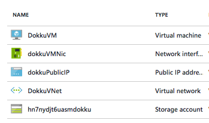

## Provisioning Platform for Development and Testing
Now that we have built our app, let's create an environment for our developers to push their components to continously integrate and deploy.

In this module, you will learn how to create your own application platform on Azure and in the next module you will learn how to deploy and scale the app we built in previous module to this platform on Azure.

### What is Dokku
[Dokku](http://dokku.viewdocs.io/dokku/) is a Docker powered, single instance, open source Platform for deploying apps for development and testing. 

It enables developers to self-host a platform that automatically builds a Docker image for any application you push to it. These apps can be connected to databases that also run as local containers using container linking.

### Provisioning Resources for Dokku on Azure 
Before we run the installation for Dokku on Microsoft Azure, we need to provision all the required resources for Dokku. At the end of this step, we should have a Virtual Machine, a public IP, a VNET on Azure.

#### Generating two New SSH Key Pairs
For this environment, we need to create *two* new SSH key pairs. Follow [these steps](https://help.github.com/articles/generating-ssh-keys/) to create these SSH key pairs to be used for accessing the host and for deploying apps to Dokku using `ssh-keygen`. 

> Note: 
> * When prompted for password, you can either provide a password for the key or press enter to ignore password. 
> * When prompted to provide a file name for the key, make sure you create two unique names. For example: `dokku` for the key to be used to ssh into the Dokku instance and `dokkuapps` for the key to be used to git push app code to Dokku.


$ ssh-keygen -t rsa -b 4096 -C [your_email@email.com]


For example, here are two SSH keys to be used for accessing Dokku VM and for deploying apps to Dokku.

~/.ssh/dokku
~/.ssh/dokkuapps


Now, let's install the [Azure CLI](https://azure.microsoft.com/en-us/documentation/articles/xplat-cli-install/) to provision resources using an Azure Resource Manager (ARM) template.

First login to the Azure CLI:

$ azure login


Instruct the client to switch to ARM mode:

$ azure config mode arm


Next, download [azuredeploy.json](https://github.com/Azure/azure-quickstart-templates/blob/master/dokku-vm/azuredeploy.json) and [azuredeploy.parameters.json](https://github.com/Azure/azure-quickstart-templates/blob/master/dokku-vm/azuredeploy.parameters.json) locally. Edit `azuredeploy.parameters.json` to provide values to the parameters required for the cluster. You can also refer to a sample `azuredeploy.parameters.json` [here](https://github.com/ritazh/devopsfun/blob/gh-pages/provisiondokku/azuredeploy.parameters.json) for your reference.

- For `dnsLabelPrefix`, you need to provide a unique value for this field.

- For `SSHKEYDATA`, copy the public key of the SSH key you generated in the previous step [Generating two New SSH Key Pairs](#generating-two-new-ssh-key-pairs), then Paste the result into `parameters.json`. Make sure to copy the entire output of the public key, starting with `ssh-rsa ...`, and ends with your email. This value should be the public key of the key pair you created in the previous step for the purpose of ssh into the Dokku host. For example, ~/.ssh/dokku.pub, not the key to be used for deploying apps.


# For example, to get the public key of the dokku key:
$ cat ~/.ssh/dokku.pub


To kickoff deployment on Azure, type the following in terminal:

$ azure group create --name devopsfunrg --location "West US" --deployment-name devopsfun --template-file azuredeploy.json --parameters-file azuredeploy.parameters.json


Actual deployment time may vary. It should take less than 5 minutes for provision to complete.

To verify, you can check the `ProvisionState` by running the following command in terminal. When the deployment is completed, the `ProvisionState` should go from `Running` to `Succeeded`. 

$ azure group deployment show devopsfunrg devopsfun

# Sample output:
+ Getting deployments                                     
data:    DeploymentName     : devopsfun
data:    ResourceGroupName  : devopsfunrg
data:    ProvisioningState  : Running
...


You can also verify by logging into the [Azure Portal](https://portal.azure.com/) and once deployment is done, you should see the following resources:

<figure>
	
	<figcaption>Screenshot of Azure portal</figcaption>
</figure>

### Configuring Dokku
Once we have all the resources provisioned on Azure, let's configure Dokku to complete the setup.

Browse to the new Dokku instance by navigating to the URL below in your browser. Using the `DNSNAMEFORPUBLICIP` and `LOCATION` values you provided in the previous step. For example with the values we provided in the screenshot, this would be the URL: http://devopsfun.westus.cloudapp.azure.com.

```
http://<DNSNAMEFORPUBLICIP>.<LOCATION>.cloudapp.azure.com
```

From your browser, provide the following values to setup Dokku.

- For `Public Key`, copy and paste the entire output of the public key of the key pair you created in the previous step for the purpose of deploying apps to Dokku. For example, ~/.ssh/dokkuapps.pub, not the key pair used for SSH into the Dokku instance.


$ cat ~/.ssh/dokkuapps.pub 


- For 'Hostname', concatenate the public IP of your Dokku host with `xip.io` as its own domain name. To get the public IP of your Dokku host, you can navigate to [Microsoft Azure Portal](https://portal.azure.com/) to view the Dokku VM's public IP address.
- Select the "Use virtualhost naming for apps" checkbox.

Click `Finish Setup` to continue.

<figure>
	
	<figcaption>Screenshot of Configuring Dokku</figcaption>
</figure>

Job well done! Now let's go push some apps!

