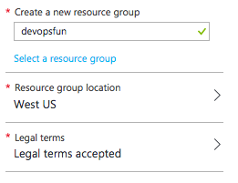
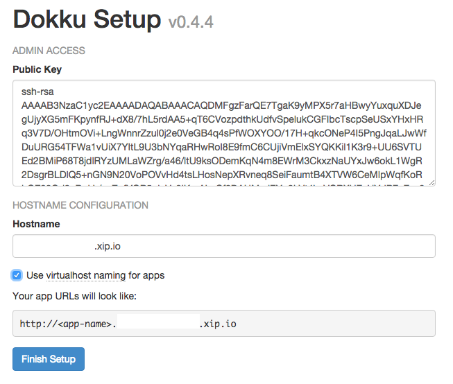

## Provisioning Platform for Development and Testing
Now that we have built our app, let's create an environment for our developers to push their components to continously integrate and deploy.

In this module, you will learn how to create your own application platform on Azure and in the next module you will learn how to deploy and scale the app we built in previous module to this platform on Azure.

### What is Dokku
[Dokku](http://dokku.viewdocs.io/dokku/) is a Docker powered open source Platform for deploying apps for development and testing. 

It enables developers to self-host a platform that automatically builds a Docker image for any application you push to it. These apps can be connected to databases that also run as local containers using container linking.

### Provisioning Resources for Dokku on Azure 
Before we run the installation for Dokku on Microsoft Azure, we need to provision all the required resources for Dokku. At the end of this step, we should have a Virtual Machine, a public IP, a VNET on Azure.

#### Generating two New SSH Key Pairs
For this environment, we need to [create two new SSH key pairs](https://help.github.com/articles/generating-ssh-keys/) to be used for accessing the host and for deploying apps using `ssh-keygen`.

$ ssh-keygen -t rsa -b 4096 -C [your_email@email.com]


For example, here are two SSH keys to be used for accessing Dokku VM and for deploying apps to Dokku.

~/.ssh/dokku
~/.ssh/dokkuapps


Now, let's head over to the [Dokku deployment for Azure page](https://azure.microsoft.com/en-us/documentation/templates/dokku-vm/) and click the `Deploy to Azure` button to provision resources using Azure Resource Manager (ARM) template.

Once you are in the [Azure Portal](https://portal.azure.com/), provide specific values for this deployment. 

- For `NEWSTORAGEACCOUNTNAME` and `DNSNAMEFORPUBLICIP`, you need to provide unique values for these fields.

- For `SSHKEYDATA`, use the public key for the SSH key you generated in [Generating two New SSH Key Pairs](#generating-two-new-ssh-key-pairs) to use to log into the host. 

# For example, to get the public key of the dokku key:
$ cat ~/.ssh/dokku.pub


<figure>
	
	<figcaption>Screenshot of Azure portal</figcaption>
</figure>

Ensure to select your Azure Subscription, then provide a unique name to create a new resource group for this deployment. 
<figure>
	
	<figcaption>Screenshot of Azure portal</figcaption>
</figure>

To kickoff deployment on Azure, click Create. 
Actual deployment time may vary. It should take less than 5 minutes for provision to complete.

### Configuring Dokku
Once we have all the resources provisioned on Azure, let's configure Dokku to complete the setup.

Browse to the new Dokku instance by navigating to the URL below in your browser. Using the `DNSNAMEFORPUBLICIP` and `LOCATION` values you provided in the previous step. For example with the values we provided in the screenshot, this would be the URL: http://devopsfun.westus.cloudapp.azure.com.

```
http://<DNSNAMEFORPUBLICIP>.<LOCATION>.cloudapp.azure.com
```

From your browser, provide the following values to setup Dokku.

- For `Public Key`, copy and paste the public key of the SSH key pair you created for deploying apps to Dokku. 

$ cat ~/.ssh/dokkuapps.pub 

- For 'Hostname', concatenate the public IP of your Dokku host with `xip.io` as its own domain name. To get the public IP of your Dokku host, you can navigate to [Microsoft Azure Portal](https://portal.azure.com/) to view the Dokku VM's public IP address.
- Select the "Use virtualhost naming for apps" checkbox.

Click `Finish Setup` to continue.

<figure>
	
	<figcaption>Screenshot of Configuring Dokku</figcaption>
</figure>

Job well done! Now let's go push some apps!

