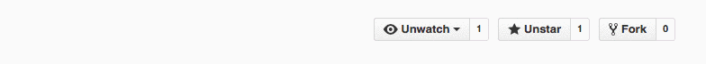
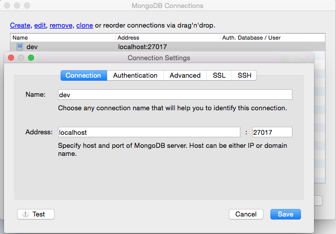
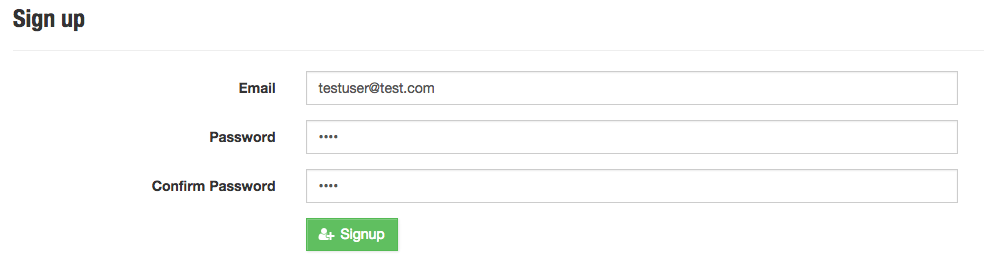
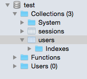
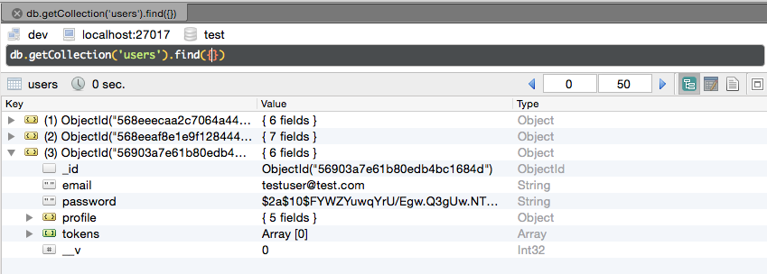

## Let's Build a Node.js App
In the previous module, we have installed and configured our development environment for building applications. Let's build a Node.js app locally, then push it for integration and testing in the next module. 

### Getting a Sample App
To focus on the learnings of this training, let's start with a sample app. Navigate to the [this sample app on GitHub](https://github.com/CatalystCode/hackathon-starter). First fork this repo into your own repo on GitHub. This sample app is a kickstarter for Node.js web applications. This app is built with Node.js, Express, Sass stylesheets, Bootstrap 3, and MongoDB. It has basic features like local authentication with email and password using mongoose, OAuth 2.0 with Passport, account management, flash message, and API examples for various social networks. In case some of these are new to you, don't worry. For the rest of the training, we will focus on getting this app built and running with a database. You can refer back to this sample app and learn the specifics in the future. 

<figure>
	
</figure>

Now we need to `git clone` to get the code locally.

$ git clone https://github.com/<your-github-username>/hackathon-starter.git


Open the project in vscode for editting.

$ cd hackathon-starter
$ code .


### Installing Dependencies
Use `npm install` to install all modules listed as dependencies in package.json.

### Installing MongoDB

#### Install MongoDB with Homebrew on Mac
To install the MongoDB binaries, run the following command:

$ brew install mongodb


#### Running MongoDB on Mac
Before you start MongoDB for the first time, create the directory to which the mongod process will write data. By default, the mongod process uses the /data/db directory. If you create a directory other than this one, you must specify that directory in the dbpath option when starting the mongod process. Make sure the user account running the `mongod` process has read and write permissions for the directory.

The following command creates the default /data/db directory:

$ mkdir -p /data/db


To run MongoDB, run the `mongod` process in terminal. If necessary, specify the path of `mongod` or the data directory.


$ mongod

# or if you have a specific data directory:
$ mongod --dbpath <path to data directory>


At this point, you should see outputs in the terminal that includes something like this:

...
MongoDB starting : pid=17447 port=27017 dbpath=/data/db/
...


You can stop MongoDB by pressing Control+C in the terminal where the mongod instance is running.

#### Install MongoDB with Installer on Windows
To install the MongoDB binaries, download the latest production release of MongoDB from the [MongoDB downloads page](http://www.mongodb.org/downloads). Ensure you download the correct version of MongoDB for your Windows system. The 64-bit versions of MongoDB do not work with 32-bit Windows.

In Windows Explorer, locate the downloaded MongoDB .msi file, which typically is located in the default Downloads folder. Double-click the .msi file. A set of screens will appear to guide you through the installation process.

#### Running MongoDB on Windows
Before you start MongoDB for the first time, create the directory to which the mongod process will write data. By default, the mongod process uses the /data/db directory. If you create a directory other than this one, you must specify that directory in the dbpath option when starting `mongod.exe`. Make sure the user account running `mongod.exe` has read and write permissions for the directory.

The following command creates the default /data/db directory:

md /data/db


To run MongoDB, run `mongod.exe` in command prompt. If necessary, specify the path of the data directory.


C:\mongodb\bin\mongod.exe

# or if you have a specific data directory:
C:\mongodb\bin\mongod.exe --dbpath <path to data directory>


You can stop MongoDB by pressing Control+C in the terminal where the mongod instance is running.

### Viewing Data
Now that we have a MongoDB instance running locally, let's install [Robomongo](http://app.robomongo.org/download.html) for MongoDB GUI. After it's installed, you can click on the first menu icon in the top left to create a new connection for `Address: localhost:27017` to view the data.
<figure>
	
	<figcaption>Setting up new database connection in Robomongo</figcaption>
</figure>

### Running the App
To start our Node.js application, simply run `node app.js`. Now browse to `http://localhost:3000` in your browser to view the sample app. Go ahead and create a new account.

<figure>
	
	<figcaption>Create a new user account in the app</figcaption>
</figure>

Now go back to Robomongo GUI, find the `users` collection, you should see the new test user account added.

<figure class="half">
	
</figure>
<figure>
	
</figure>

With our sample app in place, now we are ready to push it for testing in other environments.

